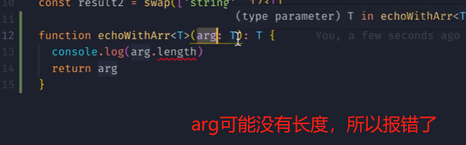
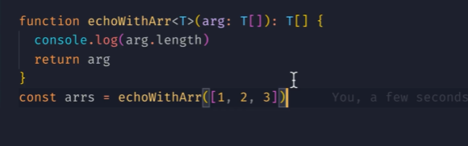
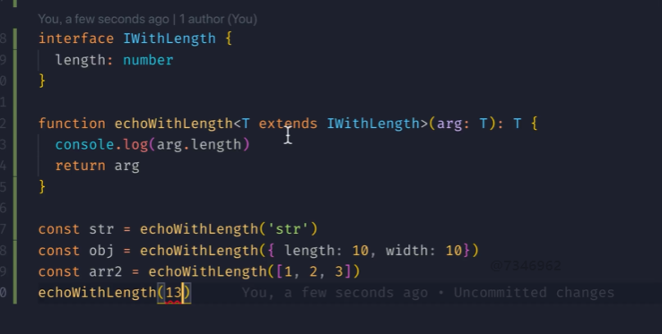

# Typescript基础

## 安装和使用

```sh
# 安装ts
npm i -g typescript@5.1.6  
```

### tsc

- 介绍：`TypeScript Compiler`，简称`tsc`，将[TypeScript](http://blog.fpliu.com/it/software/development/language/TypeScript)语法转换为[JavaScript](http://blog.fpliu.com/it/software/development/language/JavaScript)语法

- 使用：

  ```sh
  tsc --init
  tsc xxx   # xxx需要编译的文件名
  ```

### ts-node

- 作用:`ts-node`可以直接执行`ts`文件，使用该命令会自动将`ts`转换成`js`然后运行

## 数据类型

- 数据类型分类：
  - 基本类型：`string`、`number`、`boolean`、`symbol`、`bigint`、`null`、`undefined`
  - 引用类型：`array`、`Tuple`(元组)、`object`(包含`Object`和`{}`)、`function`
  - 特殊类型：`any`(不安全)、`unknown`、`void`、`nerver`、`Enum`(枚举)
  - 其他类型：类型推理、字面量类型、交叉类型
    - `type`和`interface`
- `ts`指定变量数据类型的语法： `变量名:类型 = 赋值`

### 基本类型

- 在非严格模式下，`null` （空对象）、`undefined`（未定义） 是任何类型的子类型
- `void`：没有返回值

### 引用类型

#### 数组

```ts
// 数组
let arr:number[] = [1,2,3]  // 注意：数组也有自己的类型推断,如果左侧不写类型会自动推断
arr.push(6)

// JS里面有一种伪数组
// 使用索引的方式访问数据,但是不能使用数组的方法
function test(){
    console.log(arguments);
    arguments[0]
}
```

#### 元组

```ts
// 元组
// 数据将同一类型的数据聚合到一起,元组可以合并不同类型的对象
let user:[string,number] = ['name',111] // 类型有限制,个数也有限制,只能写这两个
```

#### 函数

- 定义函数常见的三种方式

  函数规定了 1. 函数参数类型 2.返回值类

  ```ts
  // 1.普通函数
  // 注意:可选参数必须写在最后
  function add1(x: number, y: number, z?: number): number {
      if (z) return x + y + z
      return x + y
  }
  
  // 2.函数表达式 以箭头函数的形式
  const add2 = (x: number, y: number, z?: number): number => {
      if (z) return x + y + z
      return x + y
  }
  
  // 3.公式法 变量名:类型 = 赋值 ,将已经声明函数赋值给函数类型变量
  let add3: (x: number, y: number, z?: number) => number = add1
  let add4: (x: number, y: number, z?: number) => number = add2
  // 先声明后赋值
  let add5:(x: number, y: number, z?: number) => number  
  add5 = add1
  
  // 使用接口声明函数
  interface ISum {
      (x: number, y: number, z?: number): number
  }
  let add4: ISum = add1
  ```

- 函数参数
  1. 默认参数 `=`   ，等号写在类型后直接赋值
  2. 可选参数  `?`  ，问号写在变量名后 冒号前 
  3. 参数展开符 `...number[]`，

- <font color=red>函数重载</font>

  - 适用情况：一批函数功能类似，但是**传入的参数类型或个数不同**
    - 好处：参数的类型提示确定，精确显示函数的输入输出

  - 语法：

    重载声明 + 实现声明 + 函数体

    - 重载签名：主要是精确显示函数的输入输出

    - 实现签名：主要是将所有的输入输出类型做一个全量定义，防止TS编译报错

    - 函数体：整个整个函数实现的全部逻辑。

    ```ts
    function getUserInfo(value:number):User|undefined
    function getUserInfo(value:string,count:number):User[]
    // 注意此处 实现签名的参数的写法
    function getUserInfo(value:number|string,count:number=1):User|User[]|undefined{
        if(typeof value==='number'){
            return userList.find(item=>item.id===value)
        }else{
            return userList.filter(item=>item.grades===value).slice(0,count)
        }
    }
    getUserInfo('98',3)
    ```

    总结：

    - 前半部分写函数声明，最后一个函数去实现，并且最后一个函数中的参数要兼容前面的所有。
    - 实现签名和函数体检查通过后，执行函数的时候实际上是某个重载签名+函数体，跳过了实现签名，所以可以精确提示输入输出。

  > 使用联合类型不行吗？
  >
  > - 如果不写前面重载声明，那么就是单独的联合类型
  > - 使用联合类型在调用时，**编译时的提示 输入和输出的类型是写的全部参数，提示不够清晰**。

### 特殊类型

- `any`：
  - 可以将任何类型赋值给`any`变量
  - 可以获得该变量的任意属性和方法，不报错
  - 不安全的方法
- `unknown`：
  - 较为安全，不知道传入的类型建议使用`unknown`

### 接口

#### 基本概念

- 定义：接口可以理解为形状，**描述一类事物（函数、类、对象）的形状**，都必须遵守这个规定

- 习惯：接口**第一个字母大写**

  ```ts
  interface Person {
      readonly id: number, // 只读属性
      name: string,
      age?: number,     // 可选属性
  }
  
  let viking: Person = {
      id: 1,
      name: 'viking',
      age: 20,
  }
  
  // 修改只读属性会报错
  // viking.id = 100
  ```

#### 属性

+ 可选属性 `?`，问号写在属性名之后，问号之前
+ 只读属性 `readonly`，写在属性名之前；只读属性修改会报错
  - `const`和`readonly `一个是修饰变量 一个是修饰属性
+ 任意属性 `[propName:string]:string|number|undefined`
  + 使用场景：后端传过来一堆数据，可能用不到，但是也想去兼容

#### 用来描述函数类型

```ts
// 接口写法
interface ISum{
    (x:number,y:number):number
}
const isum:ISum = (x,y)=>{
    return x + y
}

// 普通写法
const add2 = (x: number, y: number, z?: number): number => {
    if (z) return x + y + z
    return x + y
}
```

#### 可索引接口

## 枚举

- 作用：可以定义一些带名字的常量，这样可以**清晰表达意图**。
- 注意：
  - 枚举中定义的名称不能是关键字
  - 枚举的类型只能是`string`或`number`
- 语法
  - 如果没有手动给第一个枚举项赋值，枚举成员会被赋值为从0开始的递增数据，
  - 如果第一个枚举项被手动赋值为**数字**，后面的会从第一个数字开始一次递增
  - 如果第一个被赋值为**字符串**，后面的全部要手动赋值为字符串

### 数字枚举

- 枚组的类型默认为**数字类型**，默认从0开始以此累加
- 如果有设置默认值，则**只会对下面的值产生影响**，从这个数字开始递增

```ts
enum Direction {   
    Up,   // 0
    Down, // 1
    Left = 6, // 6
    Right     // 7
}
Direction.Up // 正向映射,0
Direction[0] // 反向映射,UP
```

### 字符串枚举

- 字符串枚举必须要有**默认值**，不支持**反向映射**

```ts
const Direction {
    Up = "up", 
    Down = "down",
    Left = "left" 
    Right = "right"     
}
```

### 常量枚举

- 定义：使用`const`定义`enum`，这种类型不会编译成任何 `JS`,只会编译对应的值

```ts
// 常量枚举，可以提升性能；只有常量值可以使用常量枚举
const enum Direction {   
    Up,    // 0
    Down,  // 1
    Left,  // 2
    Right  // 3
}
```

## 泛型Generics

### 基本概念

- **定义**：在定义函数、接口或类的时候，不预先指定具体的类型，而在使用的时候再指定类型

  - 可以理解为占位符，在使用的时候动态填入数据类型

- **作用**：**泛型允许一个函数接受不同类型参数**，且**会保留参数类型**

  - <font color="red" >无论传什么类型，都能返回对应的类型</font>

    

```ts
const calcArray = (data:any):any[] => {
    let list = []
    for(let i = 0; i < 3; i++){
        list.push(data)
    }
    return list
}

console.log(calcArray('d')) // ["d", "d", "d"]
```

- 上述例子中，在`calcArray`中传任何类型的参数，返回的数组都是`any`类型

- 想要的效果是：**无论传什么类型，都能返回对应的类型**，使用泛型

### 语法


- 动态约束：

  

  解决方案1：

  - 将其设置为数组类型

    但是存在缺点，字符串也有长度、对象也有这个属性，这里就没办法传入字符串和对象

  

  解决方案2

  - 动态约束 使用extends关键字

    

    


## 类型推断 联合类型 类型断言

- 类型推断：如果没有使用`:`声明类型，ts会自动推测类型的形式，后面只允许修改为这种类型
- 联合类型：
  - 可以设定多种类型,`let numOrString : string | number`
  - 在不确定类型时使用
- 类型断言：
  - 不是类型转换，用来指定一个值的类型
  - 使用场景：前面不确定类型，但是后面要对确定的类型进行操作

- `type guard`
  - 可以解决联合类型的问题，使用`typeof`判断变量类型缩小条件

## 类型别名type

- 作用：如果类型太长，那么阅读起来可能很复杂


## 声明文件

- 问题：有很多库都是基于`JS`的，如果想在`ts`中使用`JS`的库该怎么做？

- 解决方法：使用**声明文件**，文件名要求`xxx.d.ts`

  `xxx.d.ts`文件中只有类型声明，没有实际的实现代码。

  ```ts
  // 以axios为例
  declare function axios(uerl:string):string
  ```

  


本篇文章参考

[一篇浅显易懂的 TS 入门指南](https://mp.weixin.qq.com/s/KR1Q8Skf-aU1WIIbcsawuw)

[一文读懂TS的函数重载，方法重载，构造器重载](https://juejin.cn/post/7055668560965681182)

[黑马前端两小时快速掌握TypeScript(上)](https://www.bilibili.com/video/BV1xa4y1V7dP/?spm_id_from=333.337.search-card.all.click&vd_source=dde2f4dd432156027fedf9b1734ba705)

[黑马前端两小时快速掌握TypeScript(下)](https://www.bilibili.com/video/BV1ks4y1c7Dc/?spm_id_from=333.999.0.0&vd_source=dde2f4dd432156027fedf9b1734ba705)

