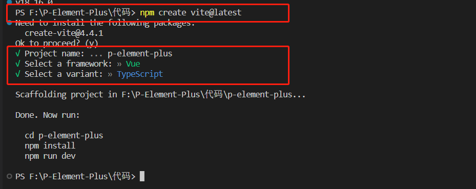
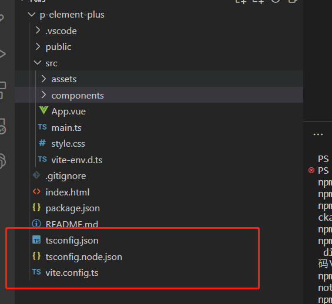
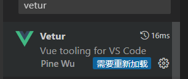
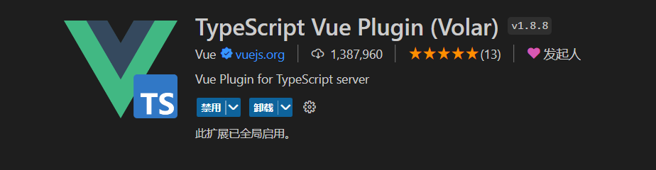
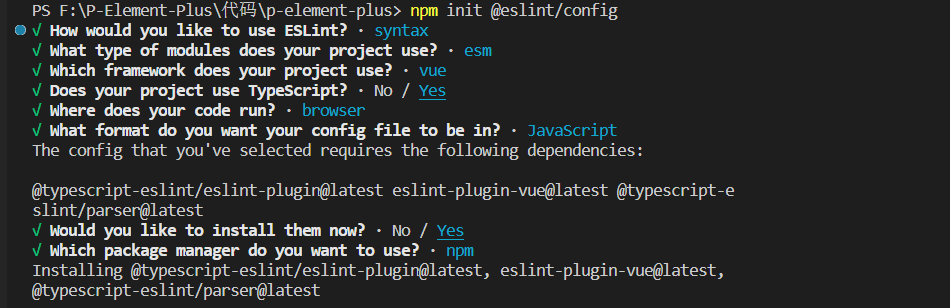

# vue3基础

## 创建项目

- 使用`vue-cli`创建`vue`项目，底层使用`webpack`

- 使用`vite`创建`vue`项目，`vite`比`webpack`要快

### 使用vue-cli创建vue项目

```sh
vue create vue_project(项目名)
```

### 使用vite创建vue项目

```sh
# 创建项目
npm create vite@latest # 输入后根据提示输入文件名、vue、ts即可
# 安装依赖
npm  i 
```



```sh
npm run dev # 本地运行项目
npm run build # 打包项目
```

## 文件结构和插件



（Vue Language Features）Volar插件 

使用volar需要禁用

TypeScript Vue Plugin (Volar) 插件



## ESlint 

### ESlint基本使用

`ESlint`是一个命令行工具。

- 下载安装

  ```sh
  npm i eslint --save-dev # 安装
  npx eslint --version # 查看版本 v8.48.0
  ```

- 配置文件

  ```sh
  # 自动生成配置文件
  npm init @eslint/config
  ```

  

- 修改配置文件`rules`

  一个` rule` 有三个等级 

  - 0 : 关闭
  - 1 : warning，输出警告，但不是错误
  - 2 : error ，会直接抛出错误

  ```javascript
  rules: {
  	'semi': 2  // 分号必须欧
  }
  ```

- 修改配置文件`Extends`

  自己手动添加一条条规则很麻烦，有些大公司和eslint有自己规则组，可以使用extends直接继承他们的规则。

  ```sh
  # eslint官方推荐规则合集，后面会使用vue和ts的，不用这个
  "extends":"eslint:recommended"
  ```

### ESlint结合vite

- 作用：让`vite`在运行的时候可以检测`ESlint`的错误

- 使用步骤：

  - 安装需要的插件

    ```sh
    # 安装插件
    npm i vite-plugin-eslint --save-dev # eslint和vite联动
    npm install eslint-plugin-vue  --save-dev # vue规则组
    npm install @vue/eslint-config-typescript --save-dev # ts规则组
    ```

    同时需要在`vscode`中安装`eslint`插件，使其可以在编辑器中提示`eslint`错误

  - 修改`vite.config.js`

    ```js
    import { defineConfig } from 'vite'
    import vue from '@vitejs/plugin-vue'
    import eslint from 'vite-plugin-eslint' // 这里
    
    // https://vitejs.dev/config/
    export default defineConfig({ 
      plugins: [vue(),eslint()],            // 这里
    })
    
    ```

  - 修改`.eslintrc.cjs`

    ```js
    module.exports = {
        "env": {
            "browser": true,
            "es2021": true,
            "node": true
        },
        "overrides": [
        ],
        // 针对Vue和ts文件的规则
        "extends": ["plugin:vue/vue3-essential", '@vue/eslint-config-typescript'],
        "parserOptions": {
            "ecmaVersion": "latest",
            "parser": '@typescript-eslint/parser',
            "sourceType": "module"
        },
        "rules": {
            "Semi": 0,
        }
    }
    ```

---

**总结**

- 创建 eslint 配置文件
- 运行 eslint （三个环境：命令行，编辑器，脚手架工具）
- 看懂 eslint 报错，并且按自己的要求修改单条规则
- 安装 extends 并且使用


