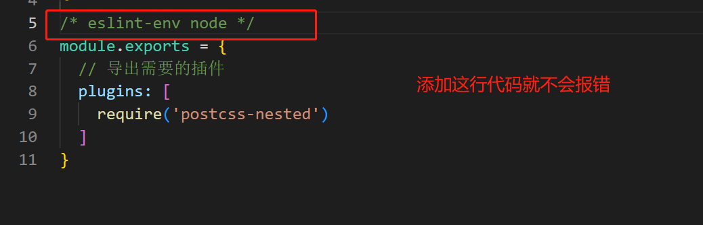

# Button按钮组件

## 需求分析

`Button `组件大部分关注样式，没有交互。

根据分析可以得到`Button`属性列表：

- `type`：不同的样式 (`Primary, Danger, Info, Success, Warning`)，表现为颜色不同
- `plain`: 样式的不同展现模式 boolean，朴素模式，边框有颜色
- `round`：圆角 `boolean`
- `circle`：圆形按钮，适合图标` boolean`
- `size`: 不同大小 (`small/normal/large`)
- `disabled`：禁用` boolean`
- *图标*：后面再添加
- `*loading`：*后面再添加

**Button 组件的本质**：<font color=red>就是不同class名称的组合</font>

- 命名规则：遵守`BEM`命名规范
- `pp`是我自己的名称前缀

```html
class = "pp-button pp-button--primary pp-button--large is-plain is-round is-disabled"
```

## 项目初始化

### vue-create创建项目

```bash
# vue官方提供的基于vite的项目初始化命令
npm create vue@3
```


注意：

- 安装完成后，需要先使用`npm i `，安装对应的依赖才能运行`npm run dev`
- `vite.config.ts`中没有引入`eslint`的插件，需要自己手动引入，才能在`vite`运行时也输出错误；不手动引入的话，只能在编辑器界面提示错误

### 设计项目文件结构

- `components`
  - `Button`
    - `Button.vue` - 组件
    - `style.css` - 样式
    - `types.ts` - 一些辅助的 typescript 类型
    - Button.test.tsx - 测试文件
- `hooks`
  - useMousePosition.ts
  - …

### Button组件的本质

* 就是`class`名称的组合

  ```js
  // BEM命名方法 - __ --
  // 布尔值用is-xxx
  // --后面连接不同的状态,是会变化的比如 p-button--primary、p-button--danger
  // 使用模板字符串确定变化 部分内容变化的类名
  class = "p-button p-button--primary p-button--large is-plain is-round"
  ```

- `Vue`实现动态`class`

## CSS解决方法

目前`button`按钮还没有样式，毫无生气。

**CSS预处理器**

- Sass

- Less

- Stylus

- `PostCSS`

  - 使用更流行、更轻量级

  - 插件化：渐进式的样式解决方案，需要什么功能就引入什么功能
  - `vite`原生支持

**需要的功能**

- 自定义变量
- 嵌套
- 循环
- mixin

使用`PostCSS`需要什么功能就引入什么插件

## 色彩系统

每一个组件库都有自己的色谱和色彩系统，色彩系统可以分为**系统色彩体系**和**产品级色彩体系**

- 系统色彩体系

  - 基础色板：有不同颜色对应的色阶

  - 中型色板：黑白灰

- 产品级色彩体系

  - 品牌色：从基础色里面选择一个颜色
  - 功能色：如成功、失败等不同状态的颜色


## `Normalize.css`添加系统默认CSS样式

### 基本介绍

`Normalize.css` 是针对<font color=red>程序员自己未定义样式的元素</font>

- 作用：

  让不同的浏览器在渲染网页元素的时候形式更统一

  不同浏览器对没有定义CSS的一些属性的表现不同，比如`a`标签下划线和颜色

- 功能：

  **对几乎所有的默认样式进行重置**，让所有的浏览器上对于**未定义的样式**浏览效果达到一致

### 使用方法

`Normalize.css`结合`postcss.css`一起使用

#### postcsss使用方法

- `npm`下载所需的`postcss-xxx`功能，因为`postcss`是插件式 根据需要安装对应的功能

- 配置文件

  在`src/postcss.config.cjs`配置

  ```js
  /**
   * @desc:postcss需要的插件
   */
  
  /* eslint-env node */
  module.exports = {
    // 导出需要的插件
    plugins: [
      require('postcss-nested')
    ]
  }
  ```

- 解决`eslint`报错

  

  解决方法：添加注释设置`eslint`环境为`node`

  

## 知识补充

### 动态绑定class

```vue
<div :class="{active:isActive}"></div> 
```

- 动态：类名`active`是否存在取数据属性`isActive`的真假值。

- 一直存在的类名直接使用`class="xxx"`即可,`class`和`:class`可以同时存在

  

### defineProps -子组件接受父组件传值

- 作用：使用`<script setup>`时，`defineProps`子组件接收**父组件传递的值**，对值做出类型限制

- 分类

  - 运行时声明

    - 传递给` defineProps() `的参数会**作为运行时**的 `props `选项使用

    ```vue
    <script setup lang="ts">
    const props = defineProps({
      foo: { type: String, required: true },
      bar: Number
    })
    
    props.foo // string
    props.bar // number | undefined
    </script>
    ```

  - 基于类型的声明(<font color=red>使用泛型</font>)

    * 编译器会尽可能地尝试根据类型参数推导出等价的运行时选项，在**编译阶段就会推导**

    - 语法特点是：**对对象类型的限制写在了`<>`之中**

    ```vue
    <script setup lang="ts">
    const props = defineProps<{
      foo: string
      bar?: number
    }>()
    </script>
    ```

    ```vue
    <script setup lang="ts">
    // 使用接口定义defineProps的类型
    interface Props {
      foo: string
      bar?: number
    }
    
    const props = defineProps<Props>()
    </script>
    ```

### defineEmits - 子组件向父组件事件传递

### defineExpose - 子组件暴露自己的属性或方法

---

**总结**

- 以上三个`defineXxx`方法都是写在**子组件**的`<script setup>`中


### 模板中变化的类名/属性名

- 需求：`class`的类名可能是`p-button--primary`或`p-button--danger`，`--`后是什么由父组件传入决定

- 解决方法：使用中括号+模板字符串

  ```html
  // type是父组件传递进来的值
  [`pp-button-${type}`]:type,
  ```

  

### 确定vue-devtools中显示的组件名称

- 使用`<scirpt setup>`是没办法规定组件在`vue-devtools`中的名称

  <font color=red>会默认使用组件的文件名作为在`vue-devtools`即`vue`开发者工具中的名称</font>

- 想更改名称，解决方法：

  - 方法1：另外一个写一个`script`标签，定义组件的属性。

    （**但是我自己使用后提示`name`已经被废弃，报错**）
  
    ```vue
    <script lang="ts">
    import { defineComponent } from 'vue';
    export default defineComponent({
      name：'PpButton',
    })
    </script>
    
    <script setup lang="ts">
    import type { ButtonProps } from './types'  
    defineProps<ButtonProps>()  
    </script>
    ```

  - 方法2：使用插件 (我自己使用也报错)
  
    - 安装
  
      ```sh
      npm i vite-plugin-vue-setup-extend -D
      ```
  
    - 在 `vite.config.ts` 文件中配置该插件
  
      ```ts
      import VueSetupExtend from 'vite-plugin-vue-setup-extend'
      
      export default {
        plugins: [VueSetupExtend()]
      }
      ```
  
    - 在 `<script setup>` 标签中使用 `name` 属性为组件定义名称
  
  > **建议**
  >
  > - 在Vue3中，给组件的文件名就命名好 多个单词的形式，避免还需要重复命名
  >
  > - 自动使用文件名作为vue-devtools中显示的名字


### CSS自定义属性

- 作用：
  - 自定义属性在某个地方存储一个值，然后在其他许多地方引用它；如果需要改变颜色只需要改变这个变量的值即可，而不用每个都单独修改
  - 语义化的标识，比如，`--main-text-color` 会比 `#00ff00` 更易理解

- 语法

  - **定义**：属性名需要以两个减号（`--`）开头，比如 `--main-color: black;`，属性值则可以是任何有效的 CSS 值

  - **使用**：由 `var()`函数来获取变量的值，比如： `color: var(--main-color);`
