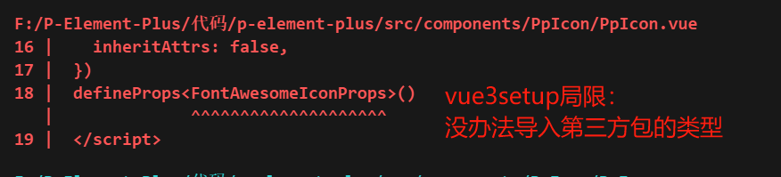

# Icon组件

## Icon发展历程

### 历史进程

- 精灵图/雪碧图
  - 以前网速比较慢，这样减少网络请求
  - 精灵图还可以做成动画效果（类似于动画书书一页一页的翻）

- `IconFont`图标字体
  
  - 通过`class`加伪类将字体图标插入到Html文档中

  - 把各种图标整合到一个字体中
  - 使用字体调用复用的过程中，不用发送新的请求
  
- `svg`矢量图 目前最流行的方案
  
  - `svg`完全可以控制，`IconFont`只能控制字符相关的属性
  - `IncoFont`需要下载的字体文件较大，而且他可能在不同浏览器下显示出不同的样子，有很多奇怪的问题。
  - 可以无限放大
  

> 补充
>
> - 位图：
>   - 像素的点组成了，放大时可以看到构成图片的无数个点点；
>   - 色彩风度，可以表现出丰富的色彩图像，可用来做动画
>   - 占用空间大
>
> - 矢量图：
>   - 由线连接的点，可以无限放大不失真，
>   - 色彩不丰富无法表示逼真的事物，通常用来表示标识，图标，logo等直接简单的
>   - 占用空间小

### 已有方案

- `Bootstrap Icons`
- `Fontawesome` 虽然名字有个`Font`，但是在五版本之后底层就已经是基于`Font`
- `Ionicon` 

> **本组件库解决方案：他山之石可以公寓**
>
> `fontawesome`结合`Vue3`

```sh
# 安装 svg core 
npm i --save @fortawesome/fontawesome-svg-core

# 安装图标库，有三种不同的类型 这里选择了solid
npm i --save @fortawesome/free-solid-svg-icons

# 安装基于 vue3 的包装
npm i --save @fortawesome/vue-fontawesome@latest-3
```

## 代码实现

### 遇到的问题

- `vue3`的`set up`局限：不能导入第三方类型

  

  解决方法：

  - 通过单独的`ts`文件作为是中介，在`ts`里面导入第三方插件库的类型，然后给类型七个别名/`extends`一下，然后再导出起别名的那个
  - 然后从`vue setup ts`中再导入单独的`ts`文件


## 知识补充

### 透传`attribute`

- 透传的属性在哪里？

  当一个组件单个根元素时，**透传的`attribute`**<font color=red>会自动被添加到根元素上</font>。

- 禁用属性继承（即不传递给根节点）

  - 适用场景：**需要在根节点以外的其他根元素使用`attribute`**

    然后使用`v-bind='$props'`将所有属性挂在到其他节点上

    >[没有参数的 `v-bind`](https://cn.vuejs.org/guide/essentials/template-syntax.html#dynamically-binding-multiple-attributes) 会将一个对象的key和value以`key=value`的形式绑定到单个元素上

  - 禁用方法：设置 `inheritAttrs` 选项为 `false`

- 

